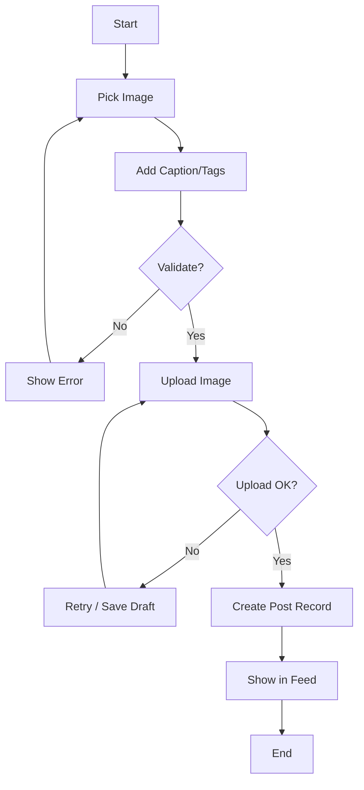

# Post Creation Flowchart

```mermaid
flowchart TD
  A[Start] --> B[Pick Image]
  B --> C[Add Caption/Tags]
  C --> D{Validate?}
  D -- No --> E[Show Error] --> B
  D -- Yes --> F[Upload Image]
  F --> G{Upload OK?}
  G -- No --> H[Retry / Save Draft] --> F
  G -- Yes --> I[Create Post Record]
  I --> J[Show in Feed]
  J --> K[End]
```