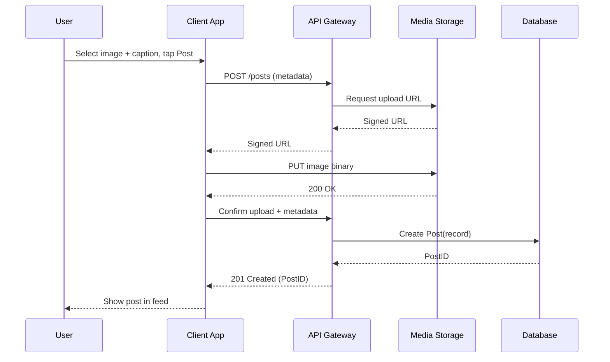

# Post Photo Sequence Diagram

```mermaid
sequenceDiagram
  participant U as User
  participant C as Client App
  participant API as API Gateway
  participant S3 as Media Storage
  participant DB as Database

  U->>C: Select image + caption, tap Post
  C->>API: POST /posts (metadata)
  API->>S3: Request upload URL
  S3-->>API: Signed URL
  API-->>C: Signed URL
  C->>S3: PUT image binary
  S3-->>C: 200 OK
  C->>API: Confirm upload + metadata
  API->>DB: Create Post(record)
  DB-->>API: PostID
  API-->>C: 201 Created (PostID)
  C-->>U: Show post in feed
```