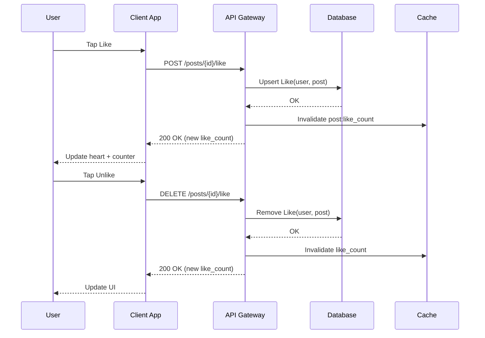

# Like/Unlike Sequence Diagram

```mermaid
sequenceDiagram
  participant U as User
  participant C as Client App
  participant API as API Gateway
  participant DB as Database
  participant Cache as Cache

  U->>C: Tap Like
  C->>API: POST /posts/{id}/like
  API->>DB: Upsert Like(user, post)
  DB-->>API: OK
  API->>Cache: Invalidate post:like_count
  API-->>C: 200 OK (new like_count)
  C-->>U: Update heart + counter

  U->>C: Tap Unlike
  C->>API: DELETE /posts/{id}/like
  API->>DB: Remove Like(user, post)
  DB-->>API: OK
  API->>Cache: Invalidate like_count
  API-->>C: 200 OK (new like_count)
  C-->>U: Update UI
```
