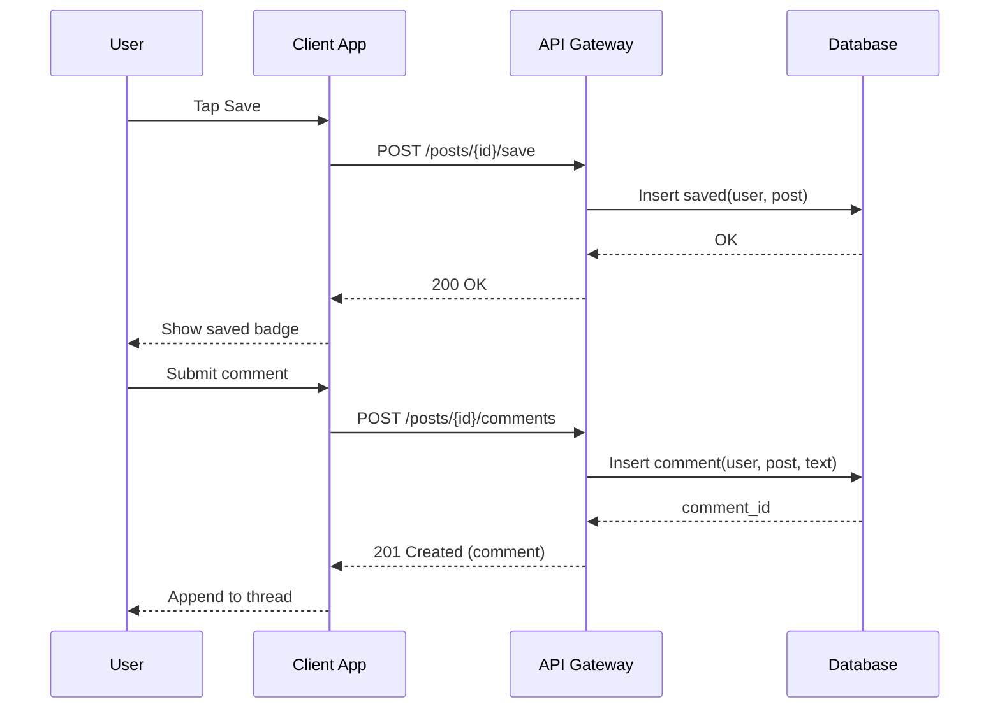

# Save and Comment Sequence Diagram

```mermaid
sequenceDiagram
  participant U as User
  participant C as Client App
  participant API as API Gateway
  participant DB as Database

  U->>C: Tap Save
  C->>API: POST /posts/{id}/save
  API->>DB: Insert saved(user, post)
  DB-->>API: OK
  API-->>C: 200 OK
  C-->>U: Show saved badge

  U->>C: Submit comment
  C->>API: POST /posts/{id}/comments
  API->>DB: Insert comment(user, post, text)
  DB-->>API: comment_id
  API-->>C: 201 Created (comment)
  C-->>U: Append to thread
```